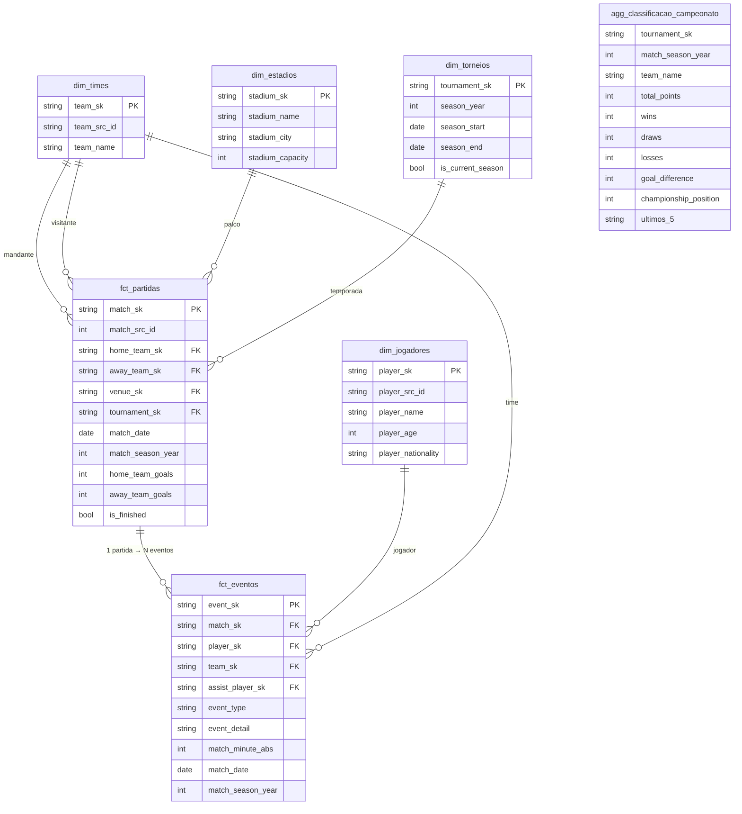

# ⚽ Futebol Analytics — End-to-End Data Engineering Pipeline

> Pipeline de dados moderno cobrindo o **Campeonato Brasileiro Série A de 2011 a 2023** — construído sobre Databricks, dbt, Apache Airflow e Delta Lake, seguindo arquitetura Medallion e modelagem dimensional.

<br>


---

## Visão Geral

Este projeto aplica o ciclo de vida completo da engenharia de dados — ingestão, transformação, modelagem e entrega analítica — sobre dados reais de futebol brasileiro. A arquitetura foi projetada para ser **escalável**, **rastreável** e **testada automaticamente**, replicando padrões utilizados em ambientes de produção corporativos.

**O que foi construído:**
- Pipeline batch automatizado da origem ao consumo analítico
- Arquitetura Medallion em três camadas (Bronze → Silver → Gold)
- Star Schema completo com 4 dimensões e 2 fatos
- OBT de classificação pré-computada com critérios oficiais de desempate
- Orquestração dinâmica via Airflow + Astronomer Cosmos
- Esteira de CI/CD com validação automática via GitHub Actions
- Dashboard interativo com dados reais da camada Gold

---

## Arquitetura do Pipeline

```mermaid
flowchart TD
    A([📁 Fonte de Dados\nCSV · JSON]) --> B

    subgraph INGEST["🔄 Ingestão — PySpark Batch"]
        B[Staging Zone\nDatabricks Volume]
    end

    B --> C

    subgraph BRONZE["🟫 Bronze — Raw Layer"]
        C[Leitura Raw\nSchema-on-read\nSem transformações]
    end

    C --> D

    subgraph SILVER["⬜ Silver — Trusted Layer"]
        D[Limpeza & Tipagem\nDeduplicação via Window Functions\nTratamento de Encoding & Schema Drift]
    end

    D --> E

    subgraph GOLD["🟡 Gold — Analytics Layer · dbt"]
        E[dim_times] & F[dim_jogadores] & G[dim_estadios] & H[dim_torneios]
        I[fct_partidas] & J[fct_eventos]
        K[agg_classificacao_campeonato\nOBT]
        E & F & G & H --> I
        I --> J
        I --> K
    end

    subgraph ORCHESTRATION["🔀 Orquestração — Airflow + Cosmos"]
        L[DAG: run_futebol_analytics_pipeline\nLoadMode.DBT_MANIFEST\nTask por modelo · Task por teste]
    end

    subgraph CICD["⚙️ CI/CD — GitHub Actions"]
        M[PR → dbt build --target dev\nValidação automática antes do merge]
    end

    GOLD --> N([📊 Dashboard Analytics\nDatabricks Gold Layer])
    ORCHESTRATION -.->|executa| GOLD
    CICD -.->|valida| GOLD

    style INGEST fill:#1a1a2e,stroke:#4a4a8a
    style BRONZE fill:#2d1b00,stroke:#8B6914
    style SILVER fill:#1a2634,stroke:#4a7fa5
    style GOLD fill:#1a2d1a,stroke:#4a8a4a
    style ORCHESTRATION fill:#2d1a2d,stroke:#8a4a8a
    style CICD fill:#1a2d2d,stroke:#4a8a8a
```



---

## Arquitetura Medallion

```mermaid
flowchart LR
    subgraph SRC["Origem"]
        S1[CSV\nPartidas · Torneios\nEstádios]
        S2[JSON\nJogadores · Eventos]
    end

    subgraph BRZ["🟫 Bronze\nworkspace_project.bronze"]
        B1[partidas_raw]
        B2[jogadores_raw]
        B3[eventos_raw]
        B4[torneios_raw]
        B5[estadios_raw]
    end

    subgraph SLV["⬜ Silver\nworkspace_project.silver"]
        SV1[partidas]
        SV2[jogadores]
        SV3[eventos]
        SV4[torneios]
        SV5[estadios]
        SV6[times]
    end

    subgraph GLD["🟡 Gold\nworkspace_project.gold"]
        G1[dim_times]
        G2[dim_jogadores]
        G3[dim_estadios]
        G4[dim_torneios]
        G5[fct_partidas]
        G6[fct_eventos]
        G7[agg_classificacao\n_campeonato]
    end

    SRC --> BRZ
    BRZ --> SLV
    SLV -->|dbt + Airflow| GLD

    style SRC fill:#0d1117,stroke:#30363d
    style BRZ fill:#2d1b00,stroke:#8B6914
    style SLV fill:#0d1a26,stroke:#1e4a6e
    style GLD fill:#0d1f0d,stroke:#1e4a1e
```



| Camada | Responsabilidade | Tecnologia | Padrão |
|--------|-----------------|------------|--------|
| **Bronze** | Cópia fiel da origem, schema-on-read | PySpark | Append-only |
| **Silver** | Limpeza, tipagem, deduplicação | PySpark | Overwrite controlado |
| **Gold** | Modelagem dimensional, regras de negócio | dbt-databricks | Incremental Merge |

---

## Modelo de Dados — Star Schema



---

## Stack Tecnológica

| Domínio | Ferramenta | Versão | Papel |
|---------|-----------|--------|-------|
| **Orquestração** | Apache Airflow + Astronomer | 2.x / Runtime 13.5.1 | Coordena execução do pipeline |
| **Integração dbt↔Airflow** | Astronomer Cosmos | 1.7.1 | Converte manifest.json em DAG dinâmica |
| **Transformação** | dbt-databricks | 1.11.5 | Modelagem dimensional, testes, linhagem |
| **Data Warehouse** | Databricks Serverless | SQL Warehouse Pro | Processamento e armazenamento |
| **Formato de Armazenamento** | Delta Lake | 3.x | ACID, time travel, schema evolution |
| **Processamento** | PySpark | 3.x | Ingestão e transformação Bronze→Silver |
| **CI/CD** | GitHub Actions | — | Validação automática em cada PR |
| **Versionamento** | Git + GitHub | — | Conventional commits, Git Flow |

---

## Orquestração — Airflow + Astronomer Cosmos

```mermaid
flowchart TD
    A[dbt build\ndbt docs generate] -->|gera| B[manifest.json]

    subgraph AIRFLOW["Apache Airflow — DAG: run_futebol_analytics_pipeline"]
        B --> C[Astronomer Cosmos\nLoadMode.DBT_MANIFEST]
        C --> D[dim_times.run]
        C --> E[dim_jogadores.run]
        C --> F[dim_torneios.run]
        C --> G[dim_estadios.run]
        D & E & F & G --> H[fct_partidas.run]
        H --> I[fct_partidas.test]
        H --> J[fct_eventos.run]
        J --> K[fct_eventos.test]
        H --> L[agg_classificacao.run]
        L --> M[agg_classificacao.test]
    end

    style AIRFLOW fill:#0d1424,stroke:#1e4a8a
```



**Por que Cosmos com `LoadMode.DBT_MANIFEST`?**
O grafo de dependência existe **uma única vez**, dentro do dbt. O Airflow não replica lógica de dependência — ele consome o `manifest.json` e gera tasks individuais por modelo e por teste. Qualquer novo modelo adicionado ao dbt aparece automaticamente na DAG, sem alterar o orquestrador.

---

## CI/CD — GitHub Actions

```mermaid
flowchart LR
    A([Pull Request\ndev · main]) --> B[Checkout Repository]
    B --> C[Setup Python 3.10]
    C --> D[Configura profiles.yml\nvia GitHub Secrets]
    D --> E[pip install dbt-databricks]
    E --> F[dbt deps]
    F --> G[dbt build --target dev]
    G --> H{Passou?}
    H -->|✅ Sim| I([Merge liberado])
    H -->|❌ Não| J([PR bloqueado])

    style A fill:#1a2634,stroke:#4a7fa5
    style I fill:#0d1f0d,stroke:#4a8a4a
    style J fill:#2d1b00,stroke:#8B6914
```



Credenciais gerenciadas via **GitHub Secrets** — `DATABRICKS_HOST`, `DATABRICKS_HTTP_PATH`, `DATABRICKS_TOKEN`. Nenhuma credencial em código.

---

## Estratégia de Versionamento

O projeto segue **Git Flow** com **Conventional Commits** para rastreabilidade completa de cada decisão:

```
feat(gold): adiciona dim_jogadores com inferência de jogadores sem cadastro
fix(marts): corrige sort_array no collect_list para forma recente deterministica
fix(infra): ativa use_materialization_v2 para resolver schema drift no Delta
docs(readme): refatora documentação com diagramas de arquitetura
chore(ci): adiciona workflow de validação automática no PR
```

Cada commit é auditável: **o quê** foi feito, **em qual camada**, e **por quê**.

---

## Decisões de Arquitetura (ADR)

### ADR-01 — Batch em vez de Streaming
Os dados históricos de partidas não exigem latência de milissegundos. Streaming adicionaria complexidade operacional sem ganho real. **Decisão: ingestão batch com PySpark.**

### ADR-02 — Sem particionamento físico nas tabelas Silver
O volume de dados não justifica particionamento — geraria *Small Files Problem* com *metadata overhead*. **Decisão: Delta Lake nativo com `OPTIMIZE` + `ZORDER BY (match_id, match_season_year)`** para *data skipping* dinâmico.

### ADR-03 — Surrogate Keys determinísticas via MD5
Chaves sintéticas geradas com `md5(cast(business_key as string))` garantem idempotência: o mesmo registro sempre gera a mesma SK, independentemente da ordem de processamento. Joins entre fatos e dimensões nunca quebram por reprocessamento.

### ADR-04 — Star Schema + OBT híbrido
Fatos granulares (`fct_partidas`, `fct_eventos`) para flexibilidade analítica. OBT pré-computada (`agg_classificacao_campeonato`) com pontuação, desempate oficial e forma recente processados no Databricks — eliminando DAX complexo no BI e garantindo performance de consulta em qualquer ferramenta de visualização.

### ADR-05 — `on_schema_change='fail'` nos fatos incrementais
Modelos incrementais falham explicitamente se o schema mudar. Falha ruidosa é preferível a dado silenciosamente errado. Alterações de schema exigem `--full-refresh` consciente.

---

## War Stories — O que nenhum tutorial documenta

**`ORDER BY` em subquery sem `LIMIT` é silenciosamente ignorado pelo Spark**
O campo `ultimos_5` (forma recente dos times) retornava resultados em ordem arbitrária — sem erro, sem warning. Dado analítico errado com aparência de correto.
**Fix:** `sort_array(collect_list(struct(rn, result_char)), false)` com `transform` extraindo o valor após ordenação determinística.

---

**Schema drift no Delta Lake quebra em produção, não em dev**
`DELTA_SCHEMA_CHANGE_SINCE_ANALYSIS` — o Spark analisava o schema no início da query enquanto o Delta atualizava durante a execução. Dois dias de investigação.
**Fix:** `use_materialization_v2: true` no `dbt_project.yml`.

---

**`AirflowDagCycleException` sem ciclos reais no SQL**
O parser do Cosmos colapsava ao processar testes de `relationships` (foreign keys) no schema.yml, interpretando-os como dependências circulares.
**Fix:** Conversão dos testes de relacionamento para metadados passivos (`meta: references`), mantendo o catálogo de dados sem travar o orquestrador.

---

**Double trigger com `ConcurrentAppendException` no Delta**
O Airflow gerou workers paralelos concorrendo pelo mesmo log transacional do Delta durante o merge incremental.
**Fix:** `max_active_runs=1` na DAG + `dbt run --full-refresh` para sanear o estado.

---

**Encoding híbrido UTF-16 + UTF-8 corrompendo IDs**
Dados históricos chegavam em UTF-16LE, dados recentes em UTF-8. A mistura corrompia IDs silenciosamente.
**Fix:** Função "sniffer" que inspeciona os Magic Bytes do arquivo antes da leitura e aplica o decoder correto dinamicamente.

---

## Resultados Analíticos

| Temporada | Campeão | Pontos | Destaques |
|-----------|---------|--------|-----------|
| 2019 | Flamengo | 90 | Temporada mais dominante da série: 28V, 86GP |
| 2021 | Atlético-MG | 84 | Maior pontuação fora de 2019 |
| 2023 | Botafogo | 65 | Menor pontuação de campeão da janela |
| 2011–2023 | Palmeiras / Corinthians | — | 3 títulos cada — maior hegemonia |

- **13 temporadas** · **260 registros** na tabela de classificação
- **7 tabelas Gold** disponíveis no Unity Catalog
- **Cobertura completa** de partidas, eventos, times, jogadores e estádios

---

## Como Executar

### Pré-requisitos
- Docker + Astronomer CLI (`astro`)
- Conta Databricks com SQL Warehouse ativo
- Conexão `databricks_default` configurada no Airflow

### 1. Subir o Airflow localmente
```bash
cd airflow_project
astro dev start
```

### 2. Rodar o dbt localmente
```bash
cd futebol_analytics
dbt deps
dbt build --target dev
```

### 3. Gerar documentação do dbt
```bash
dbt docs generate
dbt docs serve
```

---

## Estrutura do Repositório

```
futebol-dbt-project/
├── .github/
│   └── workflows/
│       └── pr_dbt_test.yml          # CI/CD: dbt build automático no PR
├── airflow_project/
│   ├── Dockerfile                   # Astronomer Runtime 13.5.1 + dbt_venv
│   ├── dags/
│   │   ├── futebol-analytics-dag.py # DAG principal com Cosmos
│   │   └── dbt/futebol_analytics/   # Projeto dbt (runtime no Docker)
│   │       ├── models/
│   │       │   ├── marts/           # Gold: dims, fcts, agg
│   │       │   └── staging/         # Ponteiros para Silver
│   │       └── macros/
│   │           └── build_scd1_dimension.sql
├── futebol_analytics/               # Projeto dbt (desenvolvimento local)
├── dashboard_brasileirao.html       # Dashboard interativo (dados reais Gold)
└── DATA_DICTIONARY.md
```

---

> Projeto desenvolvido como laboratório prático dos conceitos de *"Fundamentals of Data Engineering"* (Joe Reis & Matt Housley) aplicados a dados reais do futebol brasileiro.
